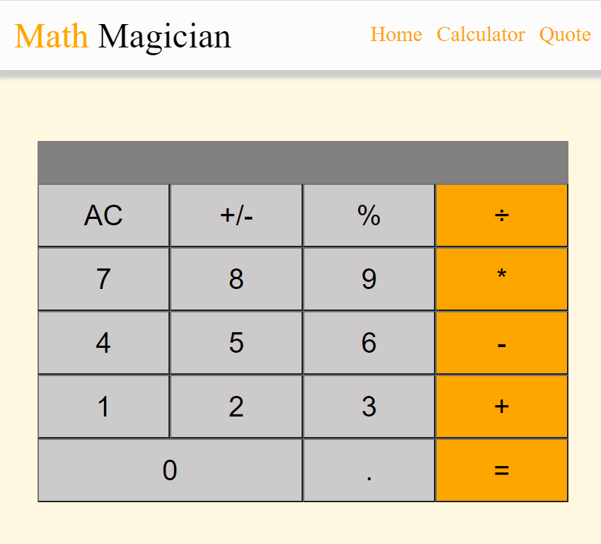

# React Calculator

- Carculator made with React, ES6, and CSS.



## Live Demo

[Live version](https://math-magicians-karmaester.herokuapp.com/)

## :hammer: Built With

- JavaScript
- React

## Getting Started

To get a local copy up and running follow these simple example steps.

### Setup

- Open the console
- Download or git clone git@github.com:karmaester/react-calculator.git
- cd react-calculator

Install Node and npm:

```
  sudo apt install nodejs
  sudo apt install npm
```

Run the following command

```
   npm run start
```

## 🤝 :raised_hand: :raised_hand: Contributing

Contributions, issues and feature requests are welcome!

Feel free to check the [issues page](https://github.com/karmaester/react-calculator/issues).

## :muscle: Show your support

Give a ⭐️ if you like this project!

## :grey_exclamation: Acknowledgments

- Microverse

## 📝 License

This project is [MIT](https://opensource.org/licenses/MIT) licensed.